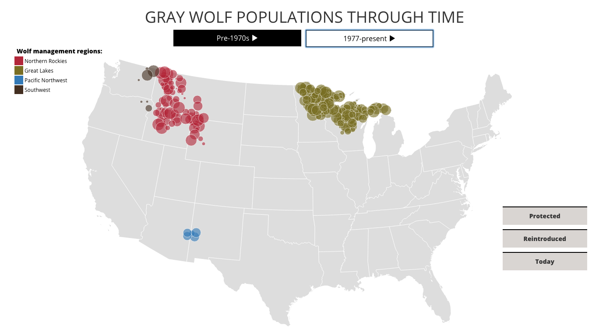
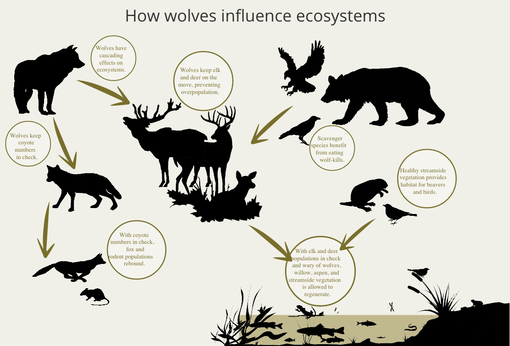
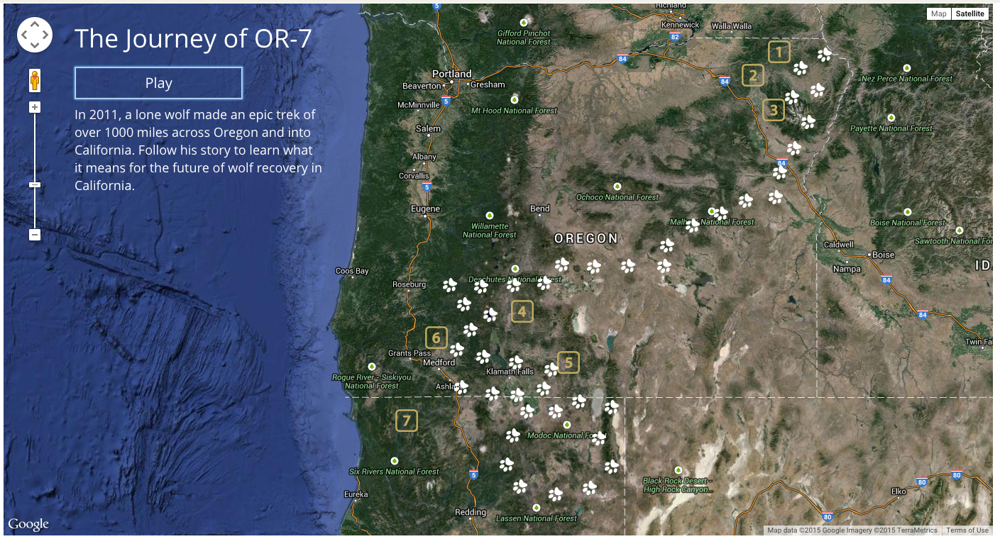

# COMEBACK
##### Visit online: graywolfstory.com

###### Lauren Richie & Rosa Choi

COMEBACK is a data visualization and storytelling narrative that describes the history of the gray wolf in the contiguous US, from persecution to restoration. It features a map visualizing wolf populations over time, interactive infographics and a story of wolf OR-7, a wolf that traveled over 1,000 miles across Oregon to become the first wolf documented in California since 1924.

Intended as a tool to educate and build awareness about one of the country's most iconic endangered species, COMEBACK provides a visually appealing, interactive story and data visualization that replaces the need to dig through antiquated websites.

##### Technical stack:
  - D3
  - TopoJSON
  - Data parsing with Ruby
  - Google Maps API

To build the project, we:
  - Collected data on wolf populations from pdfs and government websites
  - Parsed the data from spreadsheets & converted into CSV files convenient for D3 mapping
  - Wrote a script to collect location coordinates of wolf management regions and wolf OR-7's journey
  - Mapped population data over time for each management region with D3 & TopoJSON
  - Designed & created an animated, SVG-based infographic illustrating the interactions between wolves and ecosystems
  - Animated OR-7's journey with Google Maps API
  - Added interactive information boxes to tell the story of wolf eradication and recovery
  
##### Screenshots:

